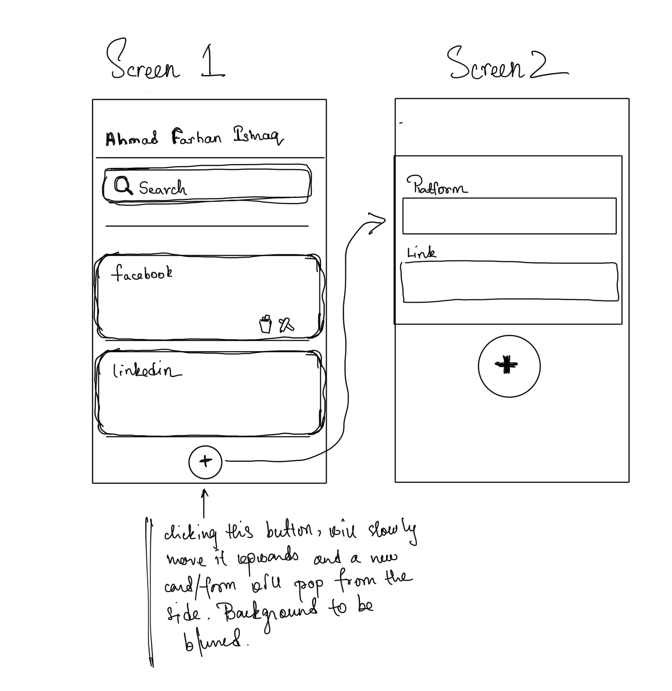
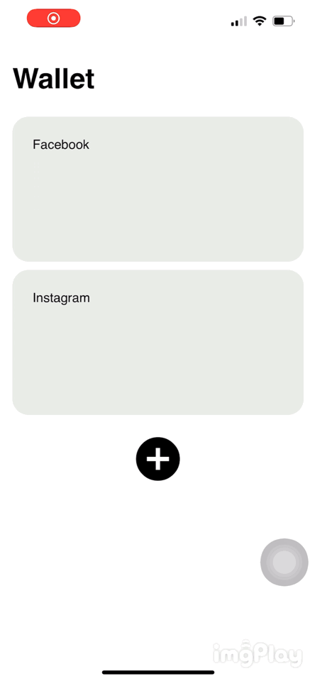

# Contact-Wallet-iOS

The native application allows users to store all their contact information in a digital wallet that mimics a business card wallet. With all user handles in one place, users can seamlessly tap to share any of their handles with people they just met. 

### Problem Statement

I was inspired to take this project after attending my school's Career Fair where I realized college students want to share their contact information seamlessly without having to spend time finding where their LinkedIn handle hides within the app. They want to just focus on relation building.

### User Story

The problem statement could be extended further through the following user story:

Mary goes to NYU and she's at a club event where she meets David. She really enjoys David's company and when David had to leave for class which starts in a few minutes, Mary asks for his Instagram handle. David pulls up his digital contact wallet and taps on his instagram handle, and airdrops his profile without having to tell her what his id was. 

### Problems Identified
1. Finding profile handles are time consuming
2. sharing multiple handles such as LinkedIn and Instagram would only make matters worse
3. Apps are usually not organized in one's home screen to be able to find what you're looking for when you really need them

### Solution

### Prototype

The main screen where all your cards reside:

The add card screen:

